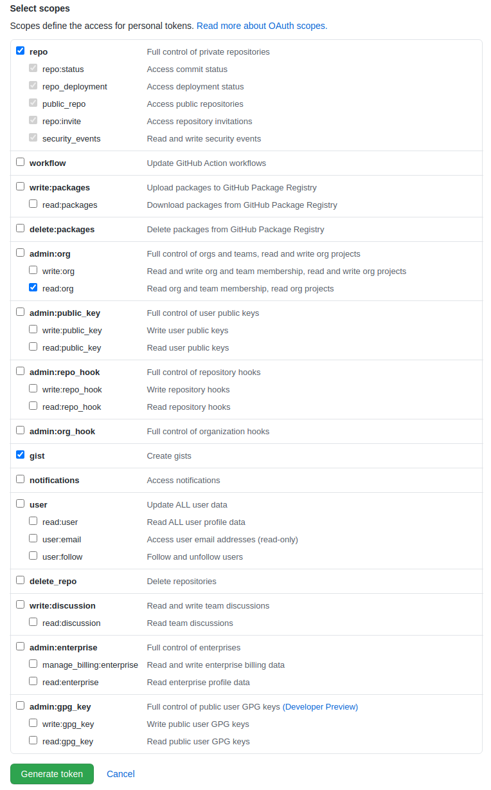
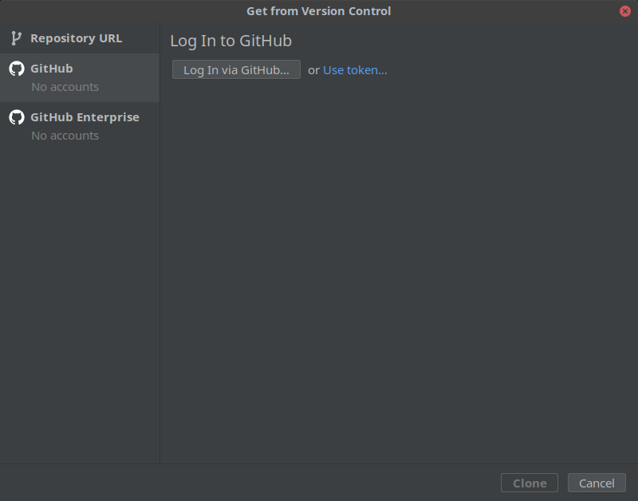
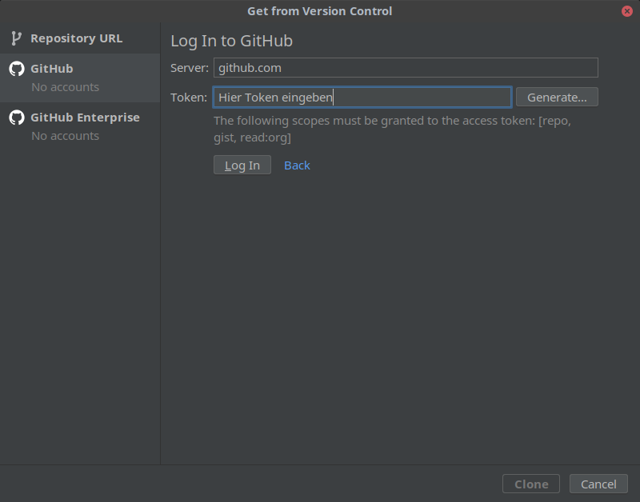
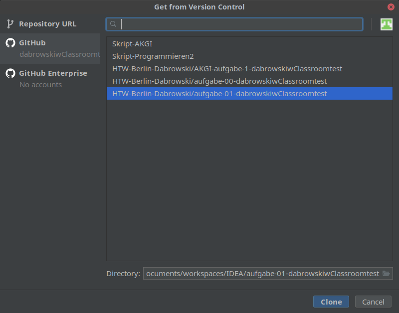

# Woche 02

## Allgemeines

In dieser Woche machen Sie sich mit github, github classroom, der Entwicklungsumgebung IDEA sowie gradle vertraut. Dazu sollten Sie sich zunächst die folgenden Videos anschauen:

 * zu [IDEA allgemein](https://mediathek.htw-berlin.de/video/Programmieren-2-IDEA-und-gradle/e473c99c6c4ace5ca0211ea9c6ddbdff)
 * zu [JavaDoc, Tests und Debugging](https://mediathek.htw-berlin.de/video/Programmieren-2-JavaDoc-Tests-Debugging/b8517e720b92ee8f4fd0253da4003b60) und
 * zum [Arbeiten mit github classroom und zu github actions](https://mediathek.htw-berlin.de/video/Programmieren-2-Github-und-github-classroom/036e3b2487ed69492f4f31320e79fa3a) - **Hinweis:** Damit das alles funktioniert, müssen Sie sich wie [hier](https://docs.github.com/en/github/authenticating-to-github/creating-a-personal-access-token) beschrieben einen github access token anlegen und sich in IDEA damit einloggen. Eine genauere Beschreibung finden Sie im nächsten Abschnitt

Die Übung dazu ist leider tatsächlich eine Fingerübung, bei der Sie eine mathematische Berechnung durchführen - aber keine Sorge, das ist das erste und letzte Mal in diesem Semester. Hintergrund ist, dass das schon technisch genug Neues ist, Sie sollen damit zunächst vertraut werden, bevor wir in der nächsten Woche mit dem ersten Projekt beginnen, bei dem Sie auch neue fachliche Hintergründe verstehen müssen.

## Erstellen eines github-Tokens und einloggen in IDEA

Die Erstellung eines github-Tokens ist [hier](https://docs.github.com/en/github/authenticating-to-github/creating-a-personal-access-token) beschrieben. Sie sollten für einen Login mittels IDEA die Rechte wie folgt setzen:

Nach dem Erstellen des Tokens können Sie in IDEA beim Import eines Projekts aus einem Versionskontrollsystem den Punkt "GitHub" auf der linken Seite auswählen:

und Ihren token eingeben:

Daraufhin können Sie ein Repository (beispielsweise Ihr privates Hausaufgaben-Repository zu der aktuellen Hausaufgabe) auswählen und wie im Video beschrieben damit arbeiten:

## Arbeit mit IDEA und github classroom

Um den Umgang mit git zu üben, arbeiten wir in diesem Modul mit github classroom. In Moodle wird jede Woche die Übungsaufgabe als ein Einladungs-Link zu github classroom veröffentlicht. Klicken Sie auf diesen Link **während Sie bei github eingeloggt sind**, so wird für Sie ein individuelles, privates Repository angelegt. Beim ersten Klick auf den Link müssen Sie aus der Liste der Teilnehmenden auswählen, wer Sie sind, damit Ihr github-Account mit Ihrem Moodle-Account verknüpft wird.

## Die Funktionsweise von git

Leider würde an dieser Stelle eine weitreichende Diskussion der Funktionsweise von git den Rahmen sprengen - eventuell lässt sich das im zweiten Projekt unterbringen. [Hier](https://www.youtube.com/watch?v=8oRjP8yj2Wo&list=PLg7s6cbtAD165JTRsXh8ofwRw0PqUnkVH) gibt es aber für die Wissbegierigen unter Ihnen eine empfehlenswerte kurze Youtube-Serie, die die Motivation für und Funktionsweise von git beschreibt.
