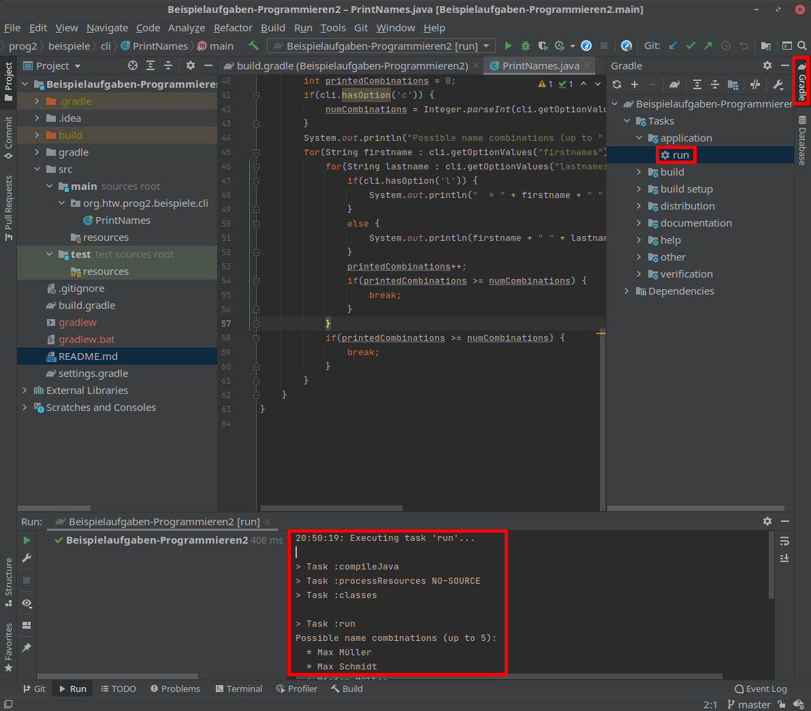
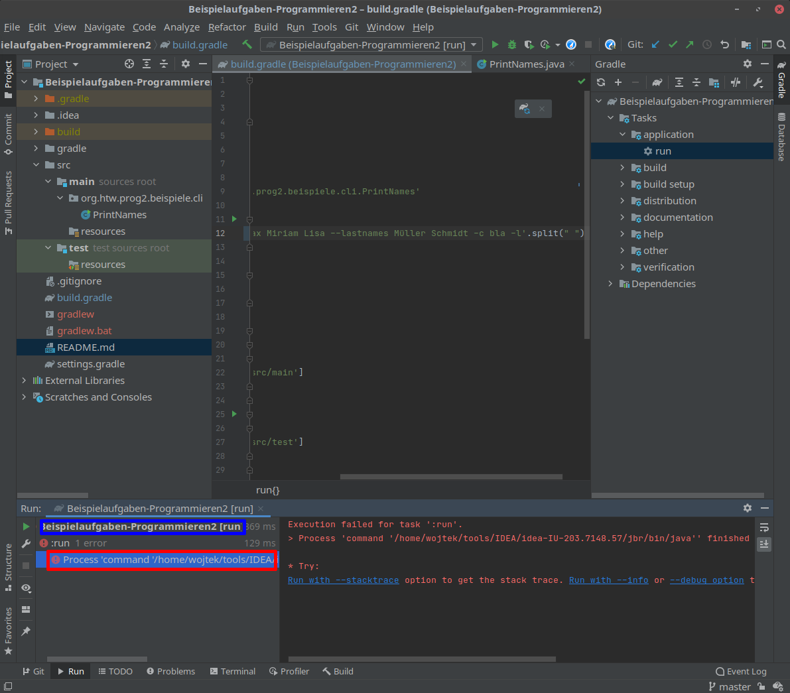

# Woche 03

In dieser Woche befassen wir uns mit der einfachsten Form von Benutzerintefraces: Dem Kommandozeileninterface. Doch zunächst holen wir noch eine wichtige Datenstruktur nach: Die HashMap.

## HashMap

Sie kennen bereits die LinkedList und die ArrayList als Möglichkeiten, Daten bequemer als mit reinen Arrays zu Organisieren. Beide eignen sich gut dafür, entweder Listen von Objekten, über die immer wieder iteriert werden muss (LinkedList) oder auf die häufig effizient über den Index zugegriffen werden muss (ArrayList) zu verwalten. Was aber tun, wenn die Entscheidung, auf welches Objekt Sie zugreifen wollen, komplexer ist? Nehmen wir als Beispiel eine Software, die bei der Planung von Budgets für Urlaubsreisen helfen soll und dafür für jede Stadt durchschnittliche Kosten für unterschiedliche Tätigkeiten (z.B. Übernachtung, Kneipenbesuch) in einer Tabelle gespeichert hat. Diese Tabelle könnte in solche Objekte eingelesen werden:

```java
public class CityCosts {
  public String cityname;
  public double hotelcost, beercost;

  public CityCosts(String cityname, double hotelcost, double beercost) {
    this.cityname = cityname;
    this.hotelcost = hotelcost;
    this.beercost = beercost;
  }
}
```

Wurde nun ein Stadtname und eine Verweildauer eingegeben, möchte man die geschätzten Kosten ausgeben. Sind die Städte allerdings in z.B. einer LinkedList gespeichert, wird das ziemlich ineffizient:

```java
  public double getStayCosts(String cityname, int days, int parties, LinkedList<CityCosts> allcosts) {
    for(CityCosts c : allcosts) {
      if(c.cityname.equals(cityname)) {
        return days*c.hotelcost + parties*c.beercost;
      }
    }
    return 0;
  }
```

Um das richtige Objekt zu finden, muss durch die gesamte Liste iteriert werden. Insbesondere, wenn es sich um Berechnungen handelt, die immer wieder durchgeführt werden müssen, schlägt sich das in der Laufzeit des Programmes nieder: Die Berechnungsdauer steigt linear mit der Anzahl an Datensätzen (in diesem Fall also: Verdoppelt sich die Anzahl der bekannten Städte, dann verdoppelt sich im Schnitt auch die Anzahl der Durchläufe der Schleife in dem oberen Beispiel, bis die richtige Stadt gefunden wurde). 

Eine Alternative stellen maps (in anderen Sprachen häufig auch dictionaries oder associative arrays genannt) dar. Diese erlauben es, auf Daten ähnlich wie in einer list über einen Index zuzugreifen - dieser Index muss aber kein Integer sein, sondern es kann ein beliebiges Objekt sein. Dabei wird der Wert, der in der map gespeichert wird, als _value_, und der "index" als _key_ bezeichnet. Die map erlaubt es also, wenn man den key kennt, darüber auf einen value zuzugreifen. Sehen wir uns mal an, wie das obere Beispiel unter Verwendung einer HashMap (einer konkreten Implementation der map - was das genau bedeutet, schauen wir uns später bei Vererbung an) aussehen würde:

```java
  public double getStayCosts(String cityname, int days, int parties, HashMap<String, CityCosts> allcosts) {
    if(allcosts.containsKey(cityname)) {
      return days*allcosts.get(cityname).hotelcost + parties*allcosts.get(cityname).beercost;
    }
    return 0;
  }
```

Nicht nur ist der Code kürzer und verständlicher, er ist auch deutlich effizienter: Die Zeit, die der Zugriff auf ein Element in einer HashMap dauert, ist nicht von der Anzahl der Elemente in der HashMap abhängig (abgesehen von Effekten, die darauf zurückzuführen sind, dass kleine Datenmengen z.T. komplett im CPU-cache vorgehalten werden könnten, während größere Datenmengen in RAM oder sogar swap ausgelagert werden müssen). 

Die HashMap heißt so, weil sie eigentlich nur ein normales array ist. Der Index, unter dem ein value dabei abgelegt wird, wird aus dem hash (falls Sie das noch nicht in einer anderen Vorlesung hatten: Eine hash-Funktion berechnet aus einem beliebig großen Objekt einen Zahlenwert, ein einfaches Beispiel wäre "Addiere die Werte aller bytes in dem Objekt zusammen und gib das Ergebnis modulo 1024 zurück" - diese Funktion würde für jedes beliebige Objekt einen Wert zwischen 0-1023 zurückgeben) des keys berechnet. Dabei muss auf ein paar Details geachtet werden: Bei zwei unterschiedlichen Objekten kann der gleiche hash-Wert rauskommen ("hash-Kollision"), der hash-Wert kann größer werden als die Länge des Arrays, das Array ist irgendwann voll und muss vergrößert werden etc. Mehr über solche Details werden Sie in dem Modul "Algorithmen und Datenstrukturen" lernen.

## Generics - erste kurze Erwähnung

In den Beispielen könnte Ihnen aufgefallen sein, dass die Listen und Maps nicht einfach als ```LinkedList mylist;``` sondern als z.B. ```LinkedList<String> mylistGeneric;``` deklariert sind. Dabei handelt es sich um Generics: Klassen, die Dinge mit anderen Klassen tun (insbesondere verwalten, wie Listen oder Maps), können generalisiert werden. Bei der Deklaration kann dann in dreieckigen Klammern angegeben werden, mit welcher anderen Klasse gearbeitet werden soll. Das hat den Vorteil, dass man sich dann darauf verlassen kann, dieses Objekt auch tatsächlich zurückzubekommen - vereinfacht gesagt könnte aus einer ```LinkedList mylist;``` bei ```mylist.get(0)``` ein String, ein Integer, eine CityCosts oder irgendein anderes Objekt rauskommen und man müsste eigentlcih immer überprüfen, was man denn gerade bekommen hat. Bei einer ```LinkedList<String> mylistGeneric;```führt der Versuch, irgendwas anderes als einen String über die ```àd```-Methode hinzuzufügen, direkt zu einem Fehler, und entsprechen kann man sich sicher sein, bei ```mylistGeneric.get(0)``` einen String zurückzubekommen. Auf die tieferen Details von generics gehen wir aber erst ein, wenn wir uns Vererbung im Detail anschauen. 

## Command line interface

Die einfachste - dadurch aber in keiner Art unwichtige - Form von Benutzerinterface ist das Kommandozeileninterface (CLI, CommandLine Interface). Diese erlauben es, Argumente an ein Programm beim Aufruf von der Kommandozeile aus zu übergeben. So ungewohnt dies wirken mag, falls man nur grafische Benutzeroberflächen (GUI, Graphical User Interface) gewohnt ist, hat das CLI gegenüber GUIs mehrere Vorteile:

 * Die Implementation ist deutlich einfacher, somit kann mit dem gleichen Aufwand ein viel höherer Funktionsumfang erreicht werden
 * Es ist eine einfache Automatisierung möglich: Basierend auf dem, was die Software tun soll, kann als String der Kommandozeilenaufruf generiert werden, während bei einem GUI umständliche Automatisierung von Mauseingaben nötig wäre
 * CLI-Software kann auch auf Servern eingesetzt werden, die keinen Bildschirm und kein Grafiksystem besitzen
 * Es ist eine effizientere Verwendung möglich: CLIs sind konzeptionell nah am natursprachlichen Modell (über den Programmnamen wird dem Computer mitgeteilt, was er tun soll, über die Argumente wird spezifiziert wie er es tun soll), während die Kommunikation über ein GUI die Interaktion auf stummes Zeigen reduziert

Das soll nicht bedeuten, GUIs hätten keine Daseinsberechtigung. Es sind aber einige Argumente, warum CLIs weiterhin relevant sind und auch in Zukunft auf absehbare Zeit viel Software mit CLI statt GUI entwickelt wird. 

### Aufbau einer Kommandozeile

Es gibt unterschiedliche Arten, Optionen an ein Programm mittels CLI zu übergeben. Ein Standard, der sich insbesondere in der Linux-Welt etabliert hat, basiert auf den GNU Coding Standards und den POSIX Conventions for Command Line Arguments. Kurz zusammengefasst:

 * Optionen müssen eine Kurzform haben (ein Buchstabe, z.B. ```n```) und können zusätzlich optional in einer Langform (ein Wort, z.B. ```name```) angegeben werden
 * Vor der Langform werden zwei Bindestriche (z.B. ```--name```) und vor der Kurzform ein Bindestrich (z.B. ```-n```) geschrieben
 * Optionen können Argumente haben (z.B. ```--name Max```). Benötigt eine Option kein Argument, wird sie als flag bezeichnet (sozusagen ein boolean-Wert, der true ist falls die Option angegeben wird, und sonst false)
 * Optionen können mehrere Argumente haben (z.B. ```--names Max Miriam```)

Ein beispielhafter Programmaufruf für ein Programm, welches Kombinationen von Vor- (```--firstnames```) und Nachnamen (```--lastnamesnames```) ausgibt und bei dem man einstellen kann, wie viele Kombinationen ausgegeben werden (```-c```) und ob sie zeilenweise ausgegeben werden sollen (```-l```) könnte sein:

```
printnames --firstnames Max Miriam Lisa --lastnames Müller Schmidt -c 5 -l
```

Die ersten beiden Optionen sind Langformen mit jeweils drei und zwei Argumenten. Die dritte Option ist eine Kurzform mit einem Argument. Die vierte Option ist wieder eine Kurzform, allerdings ohne Argument, also ein flag.  

### Apache Commons-CLI

Wie Sie sehen können, kann durch die Verwendung von Optionen und Argumenten auf der Kommandozeile eine hohe Flexibilität bei dem Einsatz von Software erreicht werden. All diese Regeln in jedem Programm manuell beim Auswerten von ```String[] args``` umzusetzen, wäre allerdings äußerst mühsam. Entsprechend gibt es externe Bibliotheken, die diese Arbeit übernehmen. In diesem Modul schauen wir uns [Apache Commons-CLI](https://commons.apache.org/proper/commons-cli/) an.  

In gradle kann Commons-CLI dem Projekt über einen Eintrag in dem dependencies-Block hinzugefügt werden:

```
dependencies {
// ...
    compile 'commons-cli:commons-cli:1.4'
}
```

Daraufhin können die notwendigen Pakete am einfachsten komplett mittels

```java
import org.apache.commons.cli.*;
```

importiert werden.

Das Auswerten der Kommandozeile geht in drei Schritten voran: Zunächst müssen die möglichen Optionen definiert werden, dann findet das Parsen von ```String[] args``` statt, um zu ermitteln welche der möglichen Optionen mit welchen Argumenten übergeben wurden, und danach kann auf die übergebenen Optionen und Argumente zugegriffen werden.

#### Definition von Optionen

Die möglichen Optionen werden in einem ```Options```-Objekt gehalten. Diesem können neue Optionen über unterschiedliche Varianten der Methode ```addOption``` hinzugefügt werden (eine genaue Beschreibung ist in der [Javadoc zu Options](https://commons.apache.org/proper/commons-cli/javadocs/api-release/org/apache/commons/cli/Options.html) zu finden):

```java
Options options = new Options();
options.addOption("l", "Print linewise"); // Nur Kurzform, keine Argumente
options.addOption("c", "count", true, "Number of combinations"); // Kurz- und Langform, nimmt ein Argument
```

Diese Standard-Versionen von ```addOption``` erlauben es, schnell und übersichtlich neue Optionen hinzuzufügen. Für mehr Kontrolle über die Details gibt es aber auch die Möglichkeit, an ```addOption``` ein zuvor genauer konfiguriertes ```Option```-Objekt zu übergeben. Dafür kann entweder das ```Option```-Objekt zunächst mittels Constructor erstellt und dann über setter-Methoden konfiguriert werden:

```java
Option opt = new Option("F", "List of first names");
opt.setArgs(Option.UNLIMITED_VALUES);
opt.setLongOpt("firstnames");
opt.setRequired(true);
options.addOption(opt);
```

Alternativ kann ein ```OptionBuilder``` verwendet werden - Sie erinnern sich vielleicht noch aus dem letzten Semester daran, dass eine statische Methode in einer Klasse verwendet werden kann, ein neues Objekt dieser Klasse zu erstellen und zurückzugeben. Ähnlich funktioniert ein Builder: Jede seiner Methoden gibt wieder einen Builder zurück, in dem der entsprechende Parameter aktualisiert wurde, so dass durch eine Kette von Aufrufen der Builder wunschgemäß konfiguriert werden kann. Ein finaler Aufruf von ```build()``` erzeugt dann ein ```Option```-Objekt mit den entsprechenden Parametern. Das ist in Java eine gängige Methode, den Code übersichtlicher zu gestalten:

```java
options.addOption(Option.builder("L").
    hasArg(true).
    numberOfArgs(Option.UNLIMITED_VALUES).
    longOpt("lastnames").
    required(true).
    desc("List of last names").build());
```

#### Parsen von Argumenten

Für das Herausparsen der definierten Optionen und ihrer Argumente aus der Kommandozeile wird ein ```CommandLineParser``` verwendet (der ```DefaultParser``` ist eine konkrete Ausprägung des ```CommandLineParser``` - bei Vererbung mehr dazu). Dieser kann einen ```String[]``` parsen und gibt ein ```CommandLine```-Objekt zurück oder wirft eine ```ParseException``` (falls z.B. eine Option, für die required gesetzt wurde, nicht angegeben wurde, für eine Option die ein Argument braucht keins angegeben wurde etc.):

```java
CommandLineParser parser = new DefaultParser();
CommandLine cli;
try {
    cli = parser.parse(options, args); // args ist ein String[]
} catch (ParseException e) {
    System.out.println("Error: " + e.getMessage());
    HelpFormatter formatter = new HelpFormatter();
    formatter.printHelp("HIVDiagnostics", options);
}
```

Die Hilfsklasse ```HelpFormatter``` wird hier verwendet, um einen Standard-Hilfetext aus dem ```Options```-Objekt zu generieren, in dem alle möglichen Optionen mit Beschreibungen und zusätzlichen Informationen (ob und wie viele Argumente übergeben werden müssen, ob die Option zwingend erforderlich ist) ausgegeben werden.

#### Zugriff auf Optionen und Werte

Nach dem Parsen können aus dem ```CommandLine```-Objekt die angegebenen Optionen und ihre Werte abgefragt werden:

```java
if(cli.hasOption('c')) {
    System.out.println(cli.getOptionValue('c'))    
}
if(cli.hasOption("lastnames")) {
    System.out.println("Possible last names:");
    for(String lastname : cli.getOptionValues("lastnames")) {
        System.out.println("  * " + lastname);    
    }
}
```

Beachten Sie dabei, dass bei Optionen, die mehrere Argumente bekommen können, statt ```getOptionValue``` die Methode ```getOptionValues``` verwendet werden sollte, die alle Argumente als ```String[]``` zurückgibt. 

#### Alles zusammesetzen

Den kompletten Code können Sie in lauffähiger Form als IDEA-Projekt im [Beispielcode-Repository](https://github.com/dabrowskiw/Beispielcode-Programmieren2) (konkret in der Datei [PrintNames.java](https://github.com/dabrowskiw/Beispielcode-Programmieren2/blob/master/src/main/org/htw/prog2/beispiele/cli/PrintNames.java) finden. Es ist auch eine Laufkonfiguration definiert, mit der Sie direkt über gradle das Projekt mit Kommandozeilenparametern starten können. Relevant ist dafür die Zeile ```id 'application'```) im plugins-Bereich sowie diese Zeilen:

```
mainClassName = 'org.htw.prog2.beispiele.cli.PrintNames'

run {
    args '--firstnames Max Miriam Lisa --lastnames Müller Schmidt -c bla -l'.split(" ")
}
```

in build.gradle.

Um den gradle-Task zum Ausführen zu starten, wählen Sie auf der rechten Seite "Gradle" aus, dann Rechtsklick auf Tasks->application->run und die erste Option ("Run as") auswählen. Unten sehen Sie dann den output (rot eingerahmte Bereiche in der Abbildung):



Beachten Sie bitte: Falls es einen Fehler gibt, sehen Sie diesen nicht direkt im gradle-output, da standardmäßig die gradle-Details (und nicht die Informationen der Programmausführung) ausgewählt sind. Um die Exception aus Ihrem Code zu sehen, klicken Sie unten links auf den blau umrandeten Bereich statt auf den standardmäßig ausgewählten rot umrandeten Bereich:

