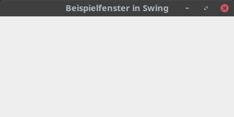
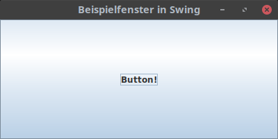
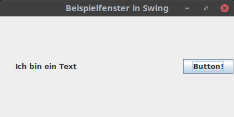
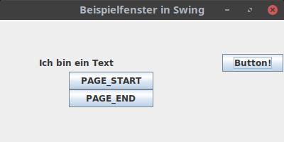

# Woche 06

In dieser Woche beginnen wir, uns die Arbeit mit grafischen Benutzerinterfaces (graphical user interface, GUI) anzuschauen.

## Unteschiedliche Herangehensweisen

Eine minimalistische abstrakte Beschreibung eines GUI ist eine Anordnung von Pixeln, die sowohl Informationen darstellen als auch auf Eingaben reagieren können. Beispielsweise ist ein Button nichts anderes, als ein Kästchen, das irgendwo auf dem Bildschirm dargestellt wird. Bei einem Mausklick wird überprüft, ob die Koordinaten des Mauszeigers sich innerhalb der Koordinaten dieses Vierecks befinden und ob keine anderen Fenster oder sonstigen GUI-Elemente aktuell diesen Button überdecken. Falls diese Bedingungen erfüllt sind, wird eine vorab definierte Funktion in dem Programm, das den Button darstellt, aufgerufen.

Betriebssysteme, die ein GUI-System anbieten (wie z. B. Linux, MacOS oder Windows), bieten auch Schnittstellen an, um genau diese Funktionalität zu gewährleisten. Programme müssen sich also nicht darum kümmern, GUI-Elemente wie Buttons, Checkboxen etc. selber darzustellen und zu verwalten, sondern sie teilen dem Betriebssystem mit, welche GUI-Elemente in welchen Fenstern wie angeordnet sein sollen und wie sie bei Interaktionen mit diesen GUI-Elementen benachrichtigt werden wollen. In Java kann auf diese Betriebssystem-spezifische Funktionalität über das Abstract Windows Toolkit, kurz awt, zugegriffen werden.

Diese Herangehensweise gibt die komplexe Verwaltung der GUI-Elemente an das Betriebssystem ab und stellt eine konsistente grafische Darstellung sicher. Nachteil ist dabei allerdings, dass eine Betriebssystem-unabhängige Programmierung erschwert wird: Bei über das Standard-Repertoire hinausgehenden GUI-Elemente ist nicht sichergestellt, dass sie in allen Betriebssystemen existieren. Zudem kann sich die Behandlung der Elemente von Betriebssystem zu Betriebssystem im Detail unterscheiden, was zu inkonsistentem Verhalten des Programms auf unterschiedlichen Betriebssystemen führen kann.

Eine Lösung für dieses Problem ist, nur die Verwaltung des Programmfensters als Ganzes an das Betriebssystem abzugeben und die GUI-Elemente selber zu implementieren. Das Betriebssystem „weiß“ dann nicht, was in dem Fenster passiert – aus seiner Sicht ist das gesamte Programmfenster irgendein Bild, dessen einzelne Pixel keine besondere Bedeutung haben. Das Programm kümmert sich dann selber darum, die GUI-Elemente in diesem Bild darzustellen, auf Klicks und sonstige Benutzereingaben zu reagieren etc. Vorteil hierbei ist, dass ein konsistentes Verhalten über alle Betriebssysteme hinweg garantiert werden kann, da das Verhalten der einzelnen GUI-Elemente nicht vom Betriebssystem abhängig ist, sondern von dem GUI-Toolkit selbstständig definiert wird. Java setzt diese Herangehensweise in dem Swing-Toolkit um.

In diesem Semester verwenden wir swing, um GUIs zu erstellen. Die dabei behandelten Konzepte können großteils aber auch direkt auf awt übertragen werden. Wichtig ist nur, dass awt-Komponenten nicht gemeinsam mit swing-Komponenten in einem Programm verwendet werden sollten, da die beiden Konzepte miteinander nicht kompatibel sind. 

## Der Aufbau eines GUI in swing

### JFrame

Das Hauptelement eines GUI in swing ist das Fenster (Frame). Da die Namen aller Swing-GUI-Elemente per Konvention mit einem J (für Java, da diese Elemente wie oben beschrieben komplett in Java implementiert sind anstatt die Betriebssystem-Elemente zu verwenden) anfangen, heißt die entsprechende swing-Klasse ```JFrame```. Ein minimales Beispiel für einen solchen ```JFrame``` ist hier zu sehen:

```java
package org.htw.prog2.woche6;

import javax.swing.*;

public class SwingWindow extends JFrame {
    public SwingWindow() {
        super("Beispielfenster in Swing");
        setSize(400, 200);
        setDefaultCloseOperation(JFrame.EXIT_ON_CLOSE);
    }

    public static void main(String[] args) {
        SwingWindow window = new SwingWindow();
        window.setVisible(true);
    }
}
```

Das Ergebnis ist folgendes Fenster:



```SwingWindow``` leitet von JFrame ab und ruft zunächst den super-Constructor mit einem Titel auf, der im Fenstertitel angezeigt werden soll. Danach wird die Größe des Fensters festgelegt und mittels ```setDefaultCloseOperation``` definiert, dass das komplette Programm beendet werden soll, wenn der JFrame geschlossen wird.

In ```main``` wird eine neue Instanz von ```SwingWindow``` erstellt und mittels ```setVisible(true)``` angezeigt. Dabei wird im Hintergrund ein neuer Thread erstellt, der die Anzeige des Fensters verwaltet - das ist der Grund, wieso das Fenster sichtbar bleibt und das Programm nicht mit dem Erreichen des Endes von ```main``` beendet wird: Solange ein Thread noch läuft (in diesem Fall der GUI-Thread), wird der Java-Prozess nicht beendet. Daher ist das Definieren des Verhaltens wenn der Frame geschlossen wird mittels ```setDefaultCloseOperation``` wichtig: Im Standardfall wird das Fenster zwar unsichtbar, aber der GUI-Thread nicht beendet, wenn das Fenster geschlossen wird, und der Java-Prozess läuft unendlich weiter.

### Weitere Elemente und Layouts

Dem JFrame können weitere Elemente hinzugefügt werden, beispielsweise hier ein JButton:

```java
import javax.swing.*;

public class SwingWindow extends JFrame {
    public SwingWindow() {
        super("Beispielfenster in Swing");
        setSize(400, 200);
        setDefaultCloseOperation(JFrame.EXIT_ON_CLOSE);
        add(new JButton("Button!"));
    }

    public static void main(String[] args) {
        SwingWindow window = new SwingWindow();
        window.setVisible(true);
    }
}
```

Durch das Hinzufügen eines neuen JButton-Objektes mittels ```add(new JButton("Button!"))``` wird dieser in dem JFrame angezeigt:



Ein GUI mit nur einem Element ist leider in den meisten Fällen wenig hilfreich. Um mehrere Elemente hinzuzufügen, muss aber definiert werden, wie diese relativ zueinander angeordnet werden sollen. Dies wird in Java über ```LayoutManager``` geregelt. Ein schöner Überblick über die verfügbaren ```LayoutManager``` ist auf der [entsprechenden Dokumentations-Seite von Oracle](https://docs.oracle.com/javase/tutorial/uiswing/layout/visual.html) zu finden. Während viele dieser Manager in Spezialfällen die Arbeit erleichtern, ist das ```GridLayout``` (welches die GUI-Elemente in einem tabellenartigen Raster anordnet) die flexibelste Variante, mit der sich jede Anordnung von Elementen umsetzen lässt. Entsprechend schauen wir uns dieses im Detail an:

```java
import javax.swing.*;
import java.awt.*;

public class SwingWindow extends JFrame {
    public SwingWindow() {
        super("Beispielfenster in Swing");
        setSize(400, 200);
        setDefaultCloseOperation(JFrame.EXIT_ON_CLOSE);
        GridBagLayout layout = new GridBagLayout();
        GridBagConstraints c = new GridBagConstraints();
        setLayout(layout);
        c.gridx = 0;
        c.gridy = 0;
        c.weightx = 1;
        add(new JLabel("Ich bin ein Text"), c);
        c.gridx = 1;
        c.weightx = 3;
        c.anchor = GridBagConstraints.LINE_END;
        add(new JButton("Button!"), c);
    }

    public static void main(String[] args) {
        SwingWindow window = new SwingWindow();
        window.setVisible(true);
    }
}
```

Hier wird zunächst ein ```GridBagLayout``` sowie ein ```GridBagConstraints``` erstellt. Das ```GridBagLayout``` wird dem ```JFrame``` mittels ```setLayout``` zugewiesen. Nun kann bei ```add``` zusätzlich zu dem GUI-Element auch ein ```GridBagConstraints``` übergeben werden, welches beschreibt, wo das GUI-Element angeordnet werden soll. Hier werden zunächst die x- und y-Koordinaten auf 0 gesetzt, bevor ein ```JLabel``` hinzugefügt wird. Danach wird die x-Koordinate auf 1 erhöht, bevor der Button hinzugefügt wird. Zudem wird über das Attribut ```weightx``` definiert, dass dem Button maximal 3-fach so viel Platz gegeben werden soll, wie dem Text, und ```anchor``` beschreibt, dass der Button am rechten Rand des ihm zugewiesenen Platzes liegen soll. Das Ergebnis ist wie folgt:



Eine Beschreibung aller Optionen der ```GridBagConstraints``` mit schönen Visualisierungen ist auf der [GridBagLayout-Dokumentationsseite von Oracle](https://docs.oracle.com/javase/tutorial/uiswing/layout/gridbag.html) zu finden. 

### Hierarchische Anordnung

Um die Erstellung noch komplexerer GUIs zu ermöglichen, können GUI-Elemente beliebig verschachtelt werden - jede swing-Komponente leitet von ```java.awt.Container``` ab und enthält somit die Methoden ```setLayout``` sowie ```add```, die wir in dem ```JFrame```-Beispiel verwendet haben. Während es wenig sinnvoll erscheint, beispielsweise einen Button weitere Komponenten hinzuzufügen, wird eine solche Verschachtelung häufig mit ```JPanel```-Elementen durchgeführt, die an sich (wenn sie leer sind) keine eigene Darstellung haben:

```java
import javax.swing.*;
import java.awt.*;

public class SwingWindow extends JFrame {
    public SwingWindow() {
        super("Beispielfenster in Swing");
        setSize(400, 200);
        setDefaultCloseOperation(JFrame.EXIT_ON_CLOSE);
        GridBagLayout layout = new GridBagLayout();
        GridBagConstraints c = new GridBagConstraints();
        setLayout(layout);
        c.gridx = 0;
        c.gridy = 0;
        c.weightx = 1;
        add(new JLabel("Ich bin ein Text"), c);
        c.gridx = 1;
        c.weightx = 3;
        c.anchor = GridBagConstraints.LINE_END;
        add(new JButton("Button!"), c);
        JPanel borderPanel = new JPanel();
        BorderLayout panelLayout = new BorderLayout();
        borderPanel.setLayout(panelLayout);
        borderPanel.add(new JButton("PAGE_START"), BorderLayout.PAGE_START);
        borderPanel.add(new JButton("PAGE_END"), BorderLayout.PAGE_END);
        c.gridx = 0;
        c.gridy = 1;
        add(borderPanel, c);
    }

    public static void main(String[] args) {
        SwingWindow window = new SwingWindow();
        window.setVisible(true);
    }
}
```

In diesem Beispiel wird ein neues ```JPanel``` mit einem eigenen Layout (in diesem Fall ein ```BorderLayout```, welches sich häufig für besonders simple GUIs anbietet) und zwei Buttons erstellt. Dann wird dieses gesamte ```JPanel``` dem ```JFrame``` in dem Feld unter dem ```JLabel``` hinzugefügt, das Ergebnis ist wie folgt:

